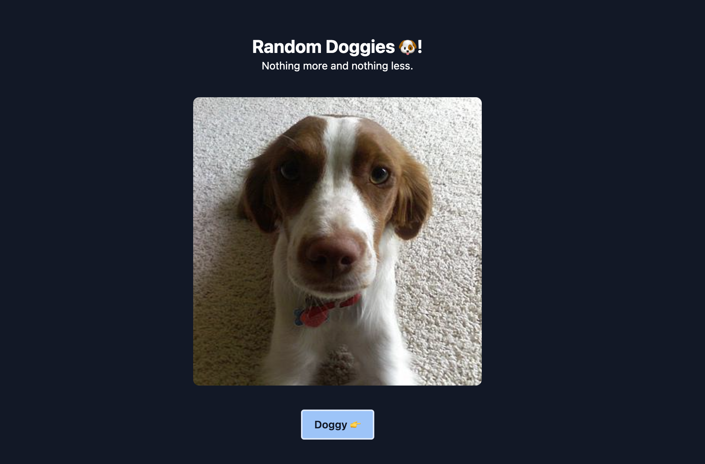

# NextJS with NX-Workspace

A site with the only purpose is to show random picture a dog, from [dog.ceo](https://dog.ceo/dog-api/documentation/random) API.

## How to

1. Clone this repository
2. Run `yarn install`
3. Run `yarn start`
4. Open `localhost:4200` on your browser

## Demo

Visit here: [https://random-doggy-c98yi1a8n-wijaksanapanji.vercel.app](https://random-doggy-c98yi1a8n-wijaksanapanji.vercel.app)
